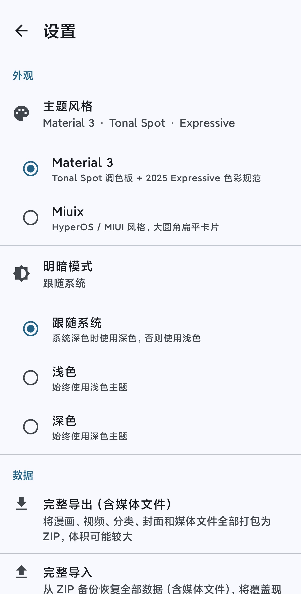

# ReadPlus

一款轻量的本地漫画 / 视频阅读器，专注于**本地媒体管理**和**沉浸式阅读 / 播放体验**。

<p align="center">
  <a href="https://github.com/Nyamuchin/ReadPlus/releases/latest">
    
  </a>
</p>

[](https://www.android.com/)
[](https://kotlinlang.org/)
[](https://developer.android.com/jetpack/compose)
[](LICENSE)
[](https://developer.android.com/about/versions/oreo)
[](https://github.com/Nyamuchin/ReadPlus/releases)
[](https://github.com/Nyamuchin/ReadPlus/releases)
[](https://github.com/Nyamuchin/ReadPlus/stargazers)

---

## 📖 项目简介

ReadPlus 是一款完全本地化的漫画和视频管理工具。它不做任何在线内容，只专注于**读好你自己的漫画**和**看好你自己的视频**。

- **8 种漫画格式**全面支持：ZIP / CBZ / CBR / PDF / EPUB / MOBI / AZW / AZW3
- 三种阅读模式（含日漫从右到左），双指缩放 + 缩略图快速跳页
- 视频竖屏瀑布流播放，滑动切换、毫秒级进度条、单击暂停
- 漫画和视频各自维护独立的分类体系
- 支持**完整数据备份**（含媒体文件），一键迁移到新设备

---

## ✨ 功能特性

### 📚 漫画

#### 格式支持

| 格式 | 扩展名 | 支持方式 |
|------|-------|---------|
| **ZIP** | `.zip` | 原生解压，按文件名自然排序 |
| **CBZ** | `.cbz` | 本质是 ZIP，直接复用 ZIP 流程 |
| **CBR** | `.cbr` | RAR 解压后转 ZIP，自然排序 |
| **PDF** | `.pdf` | 系统 PdfRenderer 实时渲染 |
| **EPUB** | `.epub` | 解析 OPF spine，按阅读顺序排列 |
| **MOBI** | `.mobi` | 扫描提取图片资源 |
| **AZW** | `.azw` | 同 MOBI |
| **AZW3** | `.azw3` | 同 MOBI |

#### 阅读体验

| 功能 | 说明 |
|------|------|
| **自然排序** | `page_2.jpg` < `page_10.jpg`，自动识别数字序号 |
| **嵌套平铺** | ZIP 内的子文件夹自动平铺，按文件名排序 |
| **三种阅读模式** | 从左到右 / 从右到左（日漫）/ 纵向滚动 |
| **双指缩放** | 支持 1x ~ 5x 自由缩放，双击放大到 2.5x |
| **缩略图跳页** | 详情页 4 列缩略图，点击任意页直接跳转 |
| **封面预览** | 详情页左上角显示封面，点击即可更换 |
| **更换封面** | 支持从漫画内选页 或 从外部图片设置 |
| **阅读进度** | 自动保存，下次打开从上次位置继续 |
| **沉浸式全屏** | 阅读时隐藏状态栏和导航栏，单击切换工具栏 |

### 🎬 视频

| 功能 | 说明 |
|------|------|
| **多格式支持** | `mp4` / `mkv` / `webm` / `avi` |
| **两种导入方式** | SAF 文件夹授权自动扫描 / 手动多选文件 |
| **竖屏瀑布流** | 上滑切换下一个，全屏沉浸式播放 |
| **单视频循环** | 每个视频播完自动从头开始 |
| **毫秒级进度条** | 暂停时展开，播放时贴底细线，支持拖动预览 |
| **单击暂停 / 继续** | 暂停时中央显示播放按钮（抖音风格） |
| **顶部信息** | 暂停时显示视频标题和所属分类 |
| **封面缓存** | 提取视频第一帧作为封面，避免切换时黑屏 |
| **零残留切换** | TextureView + 封面遮罩，滑动切换无旧帧残留 |

### 🗂 分类管理

- 漫画和视频各自维护**独立的分类体系**
- 支持新建 / 删除分类
- 长按内容卡片可"添加到分类"
- 按分类筛选查看

### 💾 数据备份

- **完整导出**：将漫画文件、视频文件、封面、分类、阅读进度打包成一个 ZIP
- **完整导入**：一键恢复到新设备
- **进度反馈**：导出 / 导入过程显示实时进度
- **脱离依赖**：导入后视频采用 `file://` URI，不依赖 SAF 授权

### 🎨 主题

- **Material 3**：Tonal Spot 调色板 + 2025 Expressive 色彩规范，Android 12+ 支持动态取色
- **Miuix**：HyperOS / MIUI 风格，大圆角扁平卡片
- 支持浅色 / 深色模式跟随系统
- 优雅的页面转场动画（500ms CubicBezier 缓动）

---

## 📱 截图

> 截图待补充

| 首页 | 漫画阅读 | 视频播放 | 设置 |
|:----:|:--------:|:--------:|:----:|
|  |  |  |  |

---

## 🛠 技术栈

| 分类 | 技术 |
|------|------|
| **语言** | Kotlin 2.0.21 |
| **UI** | Jetpack Compose + Material 3 |
| **架构** | MVVM + Clean Architecture（data / domain / ui 三层） |
| **依赖注入** | Hilt 2.53 |
| **数据库** | Room 2.6.1 |
| **视频播放** | AndroidX Media3 ExoPlayer 1.5.1 |
| **图片加载** | Coil 2.7.0（支持 gif / webp） |
| **偏好存储** | DataStore Preferences 1.1.1 |
| **导航** | Navigation Compose 2.8.5 |
| **RAR 解压** | junrar 7.5.5 |
| **序列化** | Gson 2.11.0（备份数据） |
| **构建** | AGP 8.7.3 + Gradle 8.9 |

---

## 📦 环境要求

| 组件 | 版本 |
|------|------|
| Android Studio | Ladybug (2024.3.1) 或更新 |
| JDK | 17 |
| Kotlin | 2.0.21 |
| AGP | 8.7.3 |
| Gradle | 8.9 |
| minSdk | 26 (Android 8.0) |
| targetSdk | 35 (Android 15) |

---

## 🚀 构建与运行

### 1. 克隆仓库

```bash
git clone https://github.com/Nyamuchin/ReadPlus.git
cd ReadPlus
```

### 2. 用 Android Studio 打开

启动 Android Studio → **Open** → 选择 `ReadPlus` 目录。

首次打开会自动触发 Gradle Sync，需要下载依赖，约 5~15 分钟（取决于网速）。

### 3. 运行

- 连接真机（开启 USB 调试）或创建模拟器
- 点击工具栏的 **Run** 按钮（`Shift + F10`）
- 首次安装会自动启动

### 4. 命令行构建 APK

```bash
# Debug 版
./gradlew assembleDebug
# 输出：app/build/outputs/apk/debug/app-debug.apk

# Release 版（需要配置签名）
./gradlew assembleRelease
# 输出：app/build/outputs/apk/release/app-release.apk
```

**Windows 用户注意**：PowerShell 里必须加 `.\` 前缀：

```powershell
.\gradlew.bat assembleRelease
```

---

## 📁 项目结构

```
app/src/main/java/com/readplus/
├── ReadPlusApplication.kt         # Application 入口，Coil 配置
├── MainActivity.kt                # 主 Activity，主题切换
│
├── data/                          # 数据层
│   ├── local/                     # Room 数据库
│   │   ├── entity/                # 表实体
│   │   ├── dao/                   # 数据访问对象
│   │   └── ReadPlusDatabase.kt
│   ├── source/                    # 数据源
│   │   ├── ZipArchiveManager.kt   # ZIP / EPUB 解析
│   │   ├── ZipPageFetcher.kt      # Coil 自定义 Fetcher（ZIP+PDF）
│   │   ├── PdfArchiveManager.kt   # PDF 渲染
│   │   ├── MobiExtractor.kt       # MOBI 图片提取
│   │   ├── CbrExtractor.kt        # CBR 解压
│   │   ├── EpubArchiveManager.kt  # EPUB OPF 解析
│   │   ├── NaturalOrderComparator.kt
│   │   └── VideoImporter.kt       # 视频元数据 + 封面提取
│   ├── repository/                # 仓库实现
│   ├── backup/                    # 备份 / 恢复
│   └── preferences/               # DataStore 偏好
│
├── domain/                        # 领域层
│   ├── model/                     # 领域模型
│   └── repository/                # 仓库接口
│
├── di/                            # Hilt 依赖注入
│   └── AppModule.kt
│
└── ui/                            # UI 层
    ├── ReadPlusNavHost.kt         # 导航 + 转场动画
    ├── theme/                     # 主题定义
    ├── home/                      # 首页（漫画 / 视频 Tab）
    ├── comic/
    │   ├── list/                  # 漫画网格
    │   ├── detail/                # 漫画详情（缩略图 + 封面预览）
    │   └── reader/                # 漫画阅读器
    ├── video/
    │   ├── list/                  # 视频网格
    │   └── feed/                  # 视频瀑布流
    └── settings/                  # 设置页
```

---

## 🧩 核心实现说明

### 多格式漫画统一抽象

所有漫画格式在导入时都会被"归一化"到**统一的页列表**（`List<ZipImageEntry>`）：

| 格式 | 归一化方式 |
|------|-----------|
| ZIP / CBZ | 遍历 entry，过滤图片，自然排序 |
| CBR | junrar 解压 → 重打包为 ZIP |
| MOBI / AZW / AZW3 | 扫描字节流找图片头 → 重打包为 ZIP |
| EPUB | 解析 container.xml + OPF → 按 spine 顺序 |
| PDF | 保留原文件，页列表为 `["0", "1", "2", ...]` |

阅读器、缩略图、进度保存等**上层逻辑完全不用区分格式**。

### ZIP 随机访问

`content://` URI 只能顺序读流，对漫画阅读和缩略图网格性能极差。项目在导入时将文件复制到 `filesDir/zip_cache/`，用 `java.util.zip.ZipFile` 做随机访问，并缓存 entry 索引表，把每次 `getEntry` 从 O(n) 降到 O(1)。

### 视频切页残留

`PlayerView` 默认用 `SurfaceView`，会"挖洞"透出底层内容。项目改用 **TextureView**（XML 中 `app:surface_type="texture_view"`），并在 PlayerView 上方覆盖一个**带黑底的 ImageView 封面**，用 `alpha` 控制显隐。配合 `onRenderedFirstFrame` 回调和 50ms 延迟，做到切页零残留。

### 毫秒级进度条

- 播放时：`exoPlayer.currentPosition` 每 80ms 刷新一次
- 拖动时：直接用 `dragFraction * duration` 计算显示值，帧级更新
- Seek 使用 `SeekParameters.EXACT` 全局配置，拖动实时精确跳转

### 数据备份

- **导出**：Room 元数据序列化为 `data.json`，连同封面和媒体文件一起打包成 ZIP
- **导入**：解压到 `filesDir` 对应目录，视频 URI 转成 `file://` 指向本地文件，脱离 SAF 授权依赖

### 更换封面

- **从漫画内选页**：读取指定页字节 → 写入新的封面文件（带时间戳避免缓存）
- **从外部图片**：读取 URI 内容 → 写入封面文件
- 更换时自动删除旧封面文件

---

## ❓ 常见问题

**Q: 导入 ZIP / PDF / MOBI 后显示"导入失败"？**
A: 检查文件是否真的是对应格式（有些文件后缀对但内容不对）。MOBI 可能是 DRM 加密或 HUFF 压缩，这两种情况会失败。

**Q: CBR 导入返回 0？**
A: 可能是 RAR5 格式（junrar 支持不完整）、加密 RAR 或分卷压缩。RAR4 格式的 CBR 一定能用。

**Q: 视频导入后没有封面？**
A: 部分冷门编码（如某些 mkv 的 HEVC）在部分设备上 `MediaMetadataRetriever` 提取不到帧，属正常现象，不影响播放。

**Q: 备份文件太大？**
A: 完整备份会包含所有漫画和视频文件，体积和你的媒体库等同。

**Q: 支持在线漫画源吗？**
A: 不支持，也不会支持。这是本地阅读器，专注于"读你自己的东西"。

**Q: 支持 DRM 加密的 MOBI 吗？**
A: 不支持。不做任何 DRM 破解。

---

## 🗺 路线图

- [ ] 漫画阅读器支持按图片真实比例纵向滚动
- [ ] 支持更多格式（如 7z 打包的漫画）
- [ ] 视频列表页显示分类标签
- [ ] 支持批量导出部分数据
- [ ] 支持手势自定义（左右滑动灵敏度）
- [ ] 支持自定义阅读器背景色

---

## 🤝 贡献

欢迎提交 Issue 和 Pull Request。

提交 PR 前请确保：

1. 代码通过 `./gradlew assembleDebug`
2. 遵循现有代码风格
3. Commit message 使用规范前缀（`feat:` / `fix:` / `docs:` / `refactor:` / `chore:`）

---

## 📄 开源协议

本项目采用 [MIT License](LICENSE) 开源。

你可以自由地使用、修改、分发，甚至商用，只需保留版权声明。

---

## 🙏 致谢

感谢以下开源库：

- [Jetpack Compose](https://developer.android.com/jetpack/compose)
- [Hilt](https://dagger.dev/hilt/)
- [Room](https://developer.android.com/training/data-storage/room)
- [Media3 ExoPlayer](https://developer.android.com/media/media3)
- [Coil](https://coil-kt.github.io/coil/)
- [Navigation Compose](https://developer.android.com/jetpack/androidx/releases/navigation)
- [junrar](https://github.com/junrar/junrar)

以及所有为 Android 生态做出贡献的开发者。

---

## 📧 联系

- GitHub: [@Nyamuchin](https://github.com/Nyamuchin)
- Issues: [提交 Issue](https://github.com/Nyamuchin/ReadPlus/issues)

---

<p align="center">
  Made with ❤️ and Kotlin
</p>
